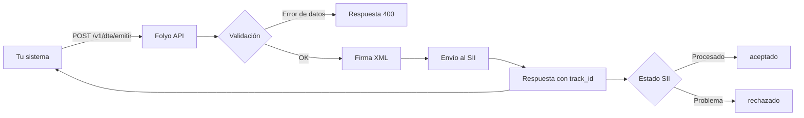

Cuando emites un DTE con Folyo, no solo estás enviando datos — estás desencadenando un proceso técnico y tributario completo que incluye validación del documento, firma digital con certificado electrónico, envío al SII y recepción del acuse de recibo. Todo esto ocurre de forma automática en menos de 2 segundos, sin que necesites intervenir en ningún paso intermedio.

## Pasos del proceso de emisión

<Steps>
  <Step title="Tu sistema llama a POST /v1/dte/emitir">
    Envías los datos del documento (tipo, emisor, receptor, detalle) en formato JSON con tu API key en el header de autorización.

    ```bash terminal
    curl --request POST \
      --url https://api.folyo.cl/v1/dte/emitir \
      --header 'Authorization: Bearer <tu_api_key>' \
      --header 'Content-Type: application/json' \
      --data '{
        "tipo_dte": 33,
        "receptor": {
          "rut": "12345678-9",
          "razon_social": "Cliente Ejemplo Ltda.",
          "giro": "Servicios de consultoría",
          "direccion": "Av. Ejemplo 456",
          "ciudad": "Santiago"
        },
        "detalle": [
          {
            "nombre": "Consultoría técnica",
            "cantidad": 1,
            "precio_unitario": 200000
          }
        ]
      }'
    ```
  </Step>

  <Step title="Folyo valida y estructura el documento">
    Folyo verifica que los datos sean correctos: RUTs válidos, montos coherentes, campos obligatorios presentes y tipo de DTE permitido para tu cuenta. Si hay un error de validación, la API responde con `400` y el detalle del problema antes de contactar al SII.
  </Step>

  <Step title="Folyo firma digitalmente el XML">
    El documento se convierte al formato XML exigido por el SII y se firma con el certificado digital del emisor. Folyo gestiona los certificados por ti — no necesitas administrarlos ni renovarlos manualmente.
  </Step>

  <Step title="El documento se envía al SII">
    Folyo transmite el documento al SII en tiempo real. No hay colas ni procesamiento asíncrono — la comunicación ocurre dentro del mismo ciclo de vida de tu petición HTTP.
  </Step>

  <Step title="Recibes la respuesta con el track_id">
    En menos de 2 segundos obtienes la respuesta de la API con el `track_id` asignado por el SII, el folio del documento y el estado inicial de la emisión.

    ```json respuesta.json
    {
      "track_id": "1234567890",
      "folio": 412,
      "tipo_dte": 33,
      "estado": "enviado",
      "fecha_emision": "2026-05-08T14:32:10Z"
    }
    ```
  </Step>

  <Step title="Consultas el estado final (opcional)">
    Con el `track_id` puedes llamar a `GET /v1/dte/estado/{track_id}` para confirmar que el SII aceptó el documento definitivamente. El estado pasa de `enviado` a `aceptado` una vez que el SII procesa el envío.
  </Step>
</Steps>

## ¿Qué es el track_id?

El `track_id` es el identificador que el SII asigna a cada envío de documentos. Folyo te lo devuelve inmediatamente en la respuesta de emisión. Úsalo para:

- Consultar el estado de aceptación del documento en el SII.
- Registrar el envío en tu sistema y asociarlo al folio emitido.
- Hacer seguimiento en caso de que el SII tarde más de lo habitual en responder.

<Info>
  El `track_id` no es el folio del documento. El folio es el número correlativo del DTE (por ejemplo, Factura N° 412). El `track_id` es el identificador del **envío** al SII y puede agrupar múltiples documentos en una misma transmisión en algunos escenarios batch.
</Info>

## Estados posibles de un DTE

Después de la emisión, un documento puede encontrarse en uno de los siguientes estados:

| Estado | Descripción |
|--------|-------------|
| `enviado` | El documento fue transmitido al SII correctamente y está pendiente de procesamiento. |
| `aceptado` | El SII procesó y aceptó el documento. Es el estado final esperado. |
| `aceptado_con_reparos` | El SII aceptó el documento pero encontró observaciones menores. Es válido tributariamente. |
| `rechazado` | El SII rechazó el documento. Debes corregir el error y emitir uno nuevo. |
| `error_envio` | No se pudo transmitir el documento al SII por un problema técnico. Folyo reintenta automáticamente. |

<Warning>
  Un documento en estado `rechazado` **no tiene valor tributario**. No lo entregues a tu cliente como comprobante de pago. Debes corregir los datos y emitir un documento nuevo.
</Warning>

## Diagrama del flujo



<Tip>
  Para la mayoría de los casos de uso — como emitir facturas en tiempo real durante el proceso de venta — no necesitas consultar el estado explícitamente. La respuesta inmediata con `estado: enviado` y el `track_id` es suficiente para continuar tu flujo de negocio.
</Tip>
